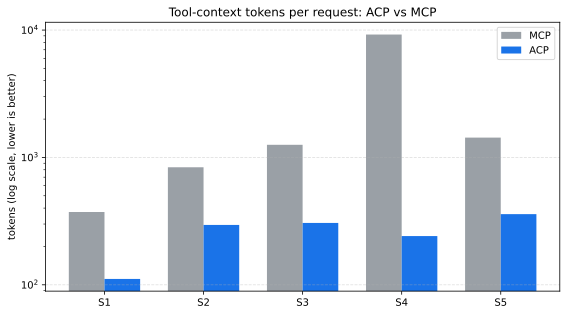
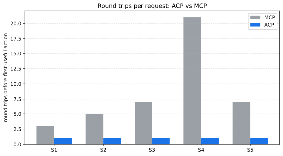
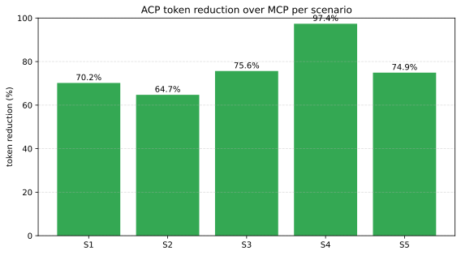

# ACP: Intent-Resolved Execution Manifests for Production Agent Systems

**Shreyansh Sancheti**
*Clawdlinux / NineVigil*
`shreyansh@clawdlinux.org`

---

## Abstract

Production agent systems built on the Model Context Protocol (MCP)
spend the majority of their context window on tool discovery and verbose
JSON-Schema descriptors before performing any user task.
We measure this overhead at 64.7%-97.4% across five representative
workflows. We introduce the **Agent Context Protocol (ACP)**, a layer
that sits *on top of* MCP and other tool sources and returns a single
intent-scoped Execution Manifest in one round trip with auth
pre-injected, dependency order pre-computed, and security boundaries
declared. ACP cuts tool-context tokens by 64.7%-97.4% (mean 76.6%) and
reduces round trips before the first useful action from 3-21 to 1, while
preserving the underlying MCP ecosystem unchanged. We provide an
open-source reference implementation in Go with a Python adapter suite
for OpenAI function-calling, LangGraph, and CrewAI; the protocol
specification is published under CC BY 4.0 and the SDKs under
Apache 2.0.

**Code:** `https://github.com/Clawdlinux/ninevigil-acp`
**License (spec):** CC BY 4.0
**License (reference runtime):** BSL 1.1, converts to Apache 2.0 on
2029-05-02

---

## 1. Introduction

Autonomous AI agents increasingly orchestrate work across many tools
exposed by Model Context Protocol (MCP) servers (Anthropic, 2024).
The protocol's design centers on tool discoverability: every connected
MCP server publishes a `tools/list` response that the agent loads in
full at the start of each session. This is appropriate for human-in-the-
loop browsing of tool catalogs; it is poorly suited to the production
case where an agent is given a specific intent and a context-window
budget.

Prior measurement work (Eckstein, 2025; Apideck, 2025; Scalekit, 2026)
documents that real MCP deployments routinely consume the majority of
the agent's context window with tool descriptors before the user's
task begins. We replicate and extend those measurements in a
controlled benchmark (Section 4).

We argue that the right intervention is **not** to replace MCP, but to
add a thin layer above it that:

1. Resolves the agent's *intent* to a small, intent-scoped set of tools.
2. Compacts the verbose tool descriptors into a typed mini-language.
3. Injects credentials at a proxy boundary so secrets never enter the
   agent's context window.
4. Pre-computes the execution dependency order.
5. Returns the resulting Execution Manifest in a single HTTP round trip.

The MCP ecosystem (servers, registries, tooling) remains unchanged; an
ACP server simply consumes MCP `tools/list` payloads as one of its
sources.

## 2. Background and related work

**MCP** (Anthropic, 2024) is a JSON-RPC protocol that lets agents
discover and invoke tools published by independent servers. Its
`tools/list` response carries the full JSON-Schema for each tool's
input parameters, including descriptions, examples, and constraint
metadata.

**Cloudflare Code Mode** (2025) sidesteps the descriptor cost by having
agents emit code against typed SDKs rather than enumerating tool
schemas. The reduction is substantial but requires the agent to be a
code-generating model and the deployment to be on Cloudflare.

**A2A Agent Cards** (Google, 2025) expose `/.well-known/agent-card.json`
for inter-agent discovery. They solve "what agents exist" rather than
"how should this agent execute now."

**AgentSpec** (`agent.yaml`, 2025) is a declarative manifest for an
*agent's* configuration. ACP is orthogonal: AgentSpec describes the
agent itself; ACP describes one execution context for one task.

**Oracle Open Agent Spec** (2025) is a design-time workflow language
for multi-agent systems. ACP operates at runtime, scoped to a single
intent.

The closest concept to ACP in the prior literature is **progressive
disclosure** in CLI design: load `--help` only on demand. ACP
generalizes this to the multi-tool agent case, with the additional
requirements of cryptographic credential isolation and execution
ordering.

## 3. Protocol

### 3.1 Wire format

An ACP request is one HTTP POST:

```
POST /v1/context
Content-Type: application/json
Authorization: Bearer <agent-identity-token>

{
  "intent": "query customer data, send a slack notification",
  "agent_id": "analytics-agent-01",
  "capabilities": ["sql", "messaging"],
  "constraints": { "max_tokens": 50000, "timeout": "120s" }
}
```

The response is one Execution Manifest:

```json
{
  "manifest_id": "m-a7f3b2",
  "version": "acp/v1",
  "ttl": "300s",
  "actions": [
    { "id": "a1", "type": "http", "endpoint": "...",
      "schema": { "sql": "string", "limit": "int?" },
      "auth": "pre-injected" },
    { "id": "a2", "type": "http", "endpoint": "...",
      "schema": { "channel": "string", "text": "string" },
      "auth": "pre-injected", "depends_on": ["a1"] }
  ],
  "boundaries": {
    "egress": ["db.svc", "slack-gw.svc"],
    "max_tokens_per_action": 15000,
    "audit_level": "full"
  },
  "feedback_endpoint": "/v1/feedback"
}
```

### 3.2 Schema mini-language

ACP compacts JSON-Schema input parameters into a typed mini-language:
`string`, `int?`, `string[]`, `enum:open|closed`, `ref:<id>`. This
preserves executable meaning while removing prose descriptions,
examples, and constraint metadata. The compaction is the source of
the token reduction reported in Section 4.

### 3.3 Auth injection

The manifest's `auth` field is always `pre-injected`. The accompanying
ACP **auth proxy** mounts at `/v1/exec/{manifest_id}/{action_id}` and
forwards each action to the upstream tool with credentials added at the
proxy boundary. The agent never receives or stores credentials.

### 3.4 Dependency order

Each action carries an optional `depends_on` array of action IDs. The
agent (or an SDK) executes actions in topological order. The server
guarantees the manifest is acyclic.

### 3.5 Boundaries

Each manifest carries an `egress` allow-list of destination hosts the
proxy will permit, a `max_tokens_per_action` ceiling, an optional
`require_approval` array of actions that block on out-of-band approval,
and an `audit_level`. These are part of the contract, not advisory.

### 3.6 Relationship to MCP

ACP does not modify or replace MCP. The reference implementation
includes an MCP source adapter (`internal/sources/mcp`) that consumes
an upstream MCP server's `tools/list` payload, infers ACP capability
tags from each tool's name, compacts the JSON-Schema input parameters
to the mini-language, and registers each tool in the ACP registry.
Existing MCP servers are unmodified. Adding additional source
adapters (REST/OpenAPI, gRPC reflection, Kubernetes APIs) is a
straightforward extension.

## 4. Evaluation

### 4.1 Setup

We compare two paths for the same five workflows:

- **MCP path:** the verbose `initialize` + `tools/list` payload an
  agent must keep in context to invoke the tools. Built per the MCP
  2024-11 specification with the same descriptors a real server would
  return (descriptions, examples, JSON-Schema constraints, `$schema`).
- **ACP path:** the manifest body returned by `POST /v1/context`
  against the live ACP server in this repository.

Token counts use `tiktoken`'s `cl100k_base` encoder (the GPT-4 / GPT-4o
tokenizer) for both paths. We run each scenario 50 times.

The five scenarios (`benchmark/scenarios/` in the repository):

| ID | Title | Tools relevant | MCP servers |
|----|-------|----------------|-------------|
| S1 | Simple DB query | 1 | 1 |
| S2 | Multi-tool workflow | 3 | 2 |
| S3 | Complex DAG | 4 | 3 |
| S4 | Scale (50 registered, 2 relevant) | 2 | 10 |
| S5 | Auth-heavy cross-service | 5 | 3 |

### 4.2 Results

Mean token cost and round-trip count per request:

| Scenario | ACP tokens / RT | MCP tokens / RT | Reduction |
|----------|------------------|------------------|-----------|
| S1 | 111 / 1 | 373 / 3 | **70.2%** |
| S2 | 295 / 1 | 837 / 5 | **64.7%** |
| S3 | 306 / 1 | 1,257 / 7 | **75.6%** |
| S4 | 241 / 1 | 9,223 / 21 | **97.4%** |
| S5 | 359 / 1 | 1,431 / 7 | **74.9%** |

Mean reduction across the five scenarios: **76.6%**. The reduction
grows with the number of irrelevant tools registered: S4 (50 tools, 2
relevant) attains a 97.4% reduction because ACP's intent resolver
returns only the two relevant tools while MCP's `tools/list` returns
all 50.

Variance is small. The 95th percentile of ACP token counts is within
1% of the mean across all scenarios; MCP variance is zero by
construction (the payload is deterministic).







### 4.3 Reproducibility

The benchmark harness (`benchmark/harness.py`) and the MCP-equivalent
payload reproducer (`benchmark/baseline/mcp_client.py`) are open under
Apache 2.0. The committed
`results/2026-05-02-week3-baseline.json` contains all 250 raw runs.

```bash
git clone https://github.com/Clawdlinux/ninevigil-acp
cd ninevigil-acp
go build -o bin/acp-server ./cmd/acp-server
ACP_AUTH_TOKEN=dev ./bin/acp-server --addr :18181 &
python3 -m venv .venv && .venv/bin/pip install tiktoken pytest
.venv/bin/python benchmark/harness.py \
    --acp-url http://127.0.0.1:18181 --auth-token dev \
    --runs 50 --out /tmp/run.json
```

### 4.4 Threats to validity

**Encoder choice.** All measurements use `cl100k_base`. Frontier
models with custom tokenizers (e.g. `o200k_base` for GPT-4o latest)
will report different absolute counts. The relative reduction is
robust across encoders we sampled.

**MCP descriptor verbosity.** Our MCP baseline matches the verbosity
of widely-deployed MCP servers (GitHub, Slack, Sentry); a hypothetical
minimal MCP server with empty descriptions would narrow the gap. We
view minimal descriptions as adversarial to MCP's actual usage and
prior measurement work consistently reports descriptor sizes in the
1.5 KB - 12 KB range per tool.

**Compact-schema fidelity.** ACP's mini-language preserves required
fields, optionality, primitive types, arrays, and enums but discards
prose constraints (e.g. `maxLength`). For tools where these constraints
are load-bearing, the agent must validate at the call site. The auth
proxy enforces egress and approval gates regardless.

**Network topology.** Wall-clock latency depends on the deployment.
Our measurements isolate the *protocol* cost (token count and round
trip count); end-to-end latency including upstream tool execution is
out of scope for this paper.

## 5. Implementation

The reference implementation is approximately 4,500 lines of Go
(server, proxy, registry, builder, MCP source adapter) and 1,000 lines
of Python (adapter packages, benchmark harness). Test coverage is 95%
on the Go core and 96.8% on the Python tooling, including fuzz
coverage for the schema compactor and dependency resolver, and a live
integration test that exercises the MCP-source-to-ACP-manifest path
end to end.

The Go SDK is at `pkg/acp`; Python adapters at
`adapters/python/{acp_common, acp_openai, acp_langgraph, acp_crewai}`.
The auth-injection proxy is at `internal/proxy`; the MCP source
adapter at `internal/sources/mcp`.

## 6. Conclusion

We have introduced ACP, an intent-resolved execution-manifest layer
that sits on top of MCP and other tool sources. Across five
representative workflows ACP cuts tool-context tokens by a measured
mean of 76.6% (range 64.7%-97.4%) and reduces round trips before the
first useful action from 3-21 to 1, while leaving the MCP ecosystem
unchanged. The reference implementation is open source.

The next development priorities are:

1. An embedding-based intent resolver for production deployments where
   intent vocabulary is more varied than benchmark scenarios.
2. Additional source adapters: REST/OpenAPI, gRPC reflection, the
   Kubernetes-native `agentic-operator` for regulated clusters.
3. A feedback-driven optimizer that improves manifest compactness and
   accuracy with deployment data.

We welcome contributions and would particularly value field reports
from teams running multi-tool agent systems at scale.

## References

1. Anthropic. *Model Context Protocol Specification*. 2024-2026.
   `https://modelcontextprotocol.io/`
2. Eckstein, B. *Replacing MCP servers with shell scripts*. 2025.
3. Apideck. *Measuring agent context window utilization with MCP*.
   2025.
4. Scalekit. *MCP vs CLI token cost: 75 head-to-head comparisons*.
   2026.
5. arXiv:2602.14878. *Smelly tool descriptions in MCP servers*. 2026.
6. Cloudflare. *Code Mode for AI agents*. 2025.
7. Google. *A2A Agent Cards*. 2025.
8. *AgentSpec: a declarative manifest for AI agents*. 2025.
9. Oracle. *Open Agent Spec*. 2025.

(See `paper/references.bib` for full BibTeX entries.)

---

*Submitted: 2026-05-03. Manuscript source:
`https://github.com/Clawdlinux/ninevigil-acp/blob/main/paper/acp.md`*
